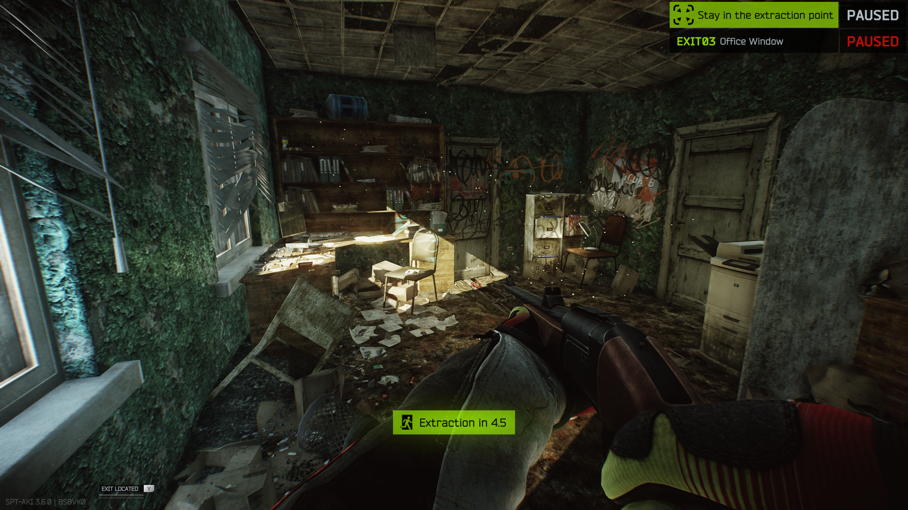
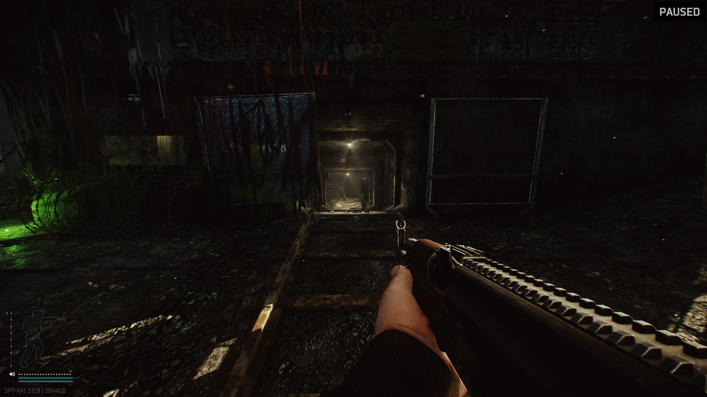

[](https://ko-fi.com/S6S3NKK32)

# ⏸️ Pause
A simple SPT mod which allows you to pause the game including the raid timer. Press P to pause.

Mostly cobbled together from Kobrakon's [Take A Break](https://github.com/kobrakon/TakeABreak) as a learning exercise.

Works with SPT 3.6.0 & 3.6.1

## Installation
Download the latest release and unzip the copy of `Epi-Pause.dll` from the version folder according to the SPT-AKI version you are running to your `([SPT]\BepInEx\plugins)` folder.

#### SPT-AKI 3.5.8
Unzip the `Epi-Pause.dll` found in the 3.5.8 folder to your `([SPT]\BepInEx\plugins)` folder.

#### SPT-AKI 3.6.0 - 3.6.1
Unzip the `Epi-Pause.dll` found in the 3.6.0-3.6.1 folder to your `([SPT]\BepInEx\plugins)` folder.

## Building
You'd need to manually add the references from the csproj file to the dependencies folder which you can copy from your SPT installation.

```
dotnet build
```

## What gets paused
- You
  - Character control
  - Health
  - Hydration & Energy
  - Stamina
- AI
- The actual game raid timer
- The fake raid timer you see when you press o
- Time of Day

## Stuff that doesn't really pause well now
Stuff that doesn't pause well at the moment and may not be worth the effort.
- Ragdolls, physics stuff in general
  - Grenades will fly but the fuses won't tick until you unpause
- You jumping (instant ice skating)
- Certain oxygen/stamina effects
  - Pause while aiming will continue to drain oxygen
  - Pause while stamina is recovering will continue to regen
- You can pause and still move inventory around (shouldn't be able to use anything)
  
## Todo & Notes
- Look into pausing time of day
  - GameTimeClass.TimeFactor
  - GameTimeClass.TimeFactorMod
- Pause audio?
  - AudioListener gameObject on DontDestroyOnLoad, set its pause field to true
- patch GClass714.Update to stop oxygen while ads (prob stam regen too)

## Screenshots
These don't show much, but you can at least see that the raid timer shows PAUSED when active.

[]()
[]()
